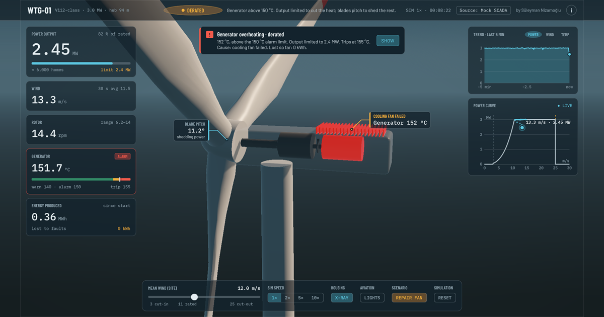

# Wind Turbine Digital Twin

A browser-based digital twin demo of a 3 MW wind turbine: a physics-based telemetry simulator, a SCADA-style
dashboard and a fault scenario with graded generator protection, derating and lost-production accounting.
Runs in desktop and mobile browsers (WebGL).

**Live demo: https://sultud.github.io/windfarm-digital-twin/**

[](https://sultud.github.io/windfarm-digital-twin/)

## Suggested walkthrough

1. Raise the mean wind above rated (about 11 m/s). Power levels off at 3 MW and the blades pitch to shed the excess.
2. Start the cooling fan failure (**FAN FAILURE** on desktop, **FAULT** on phones). The generator winding temperature
   rises through warning (140 °C), alarm with derating (150 °C) and trip (155 °C). **SHOW** moves the camera to the
   drivetrain with the nacelle housing faded out.
3. **REPAIR** the fan. The generator cools below the restart temperature (130 °C), the turbine restarts and ramps
   back to rated. The energy card reports the production lost to the event.

## Dashboard

| Audience | What it reads |
|---|---|
| Operator | Operating state (idle, producing, rated, derated, storm shutdown, fault stop) with a short explanation; power, wind, rotor speed, generator temperature, energy |
| Engineer | Power curve with the live operating point and its recent trail; trends with the actual setpoints; blade pitch shown on the 3D rotor; alarms reported as flags in the style of IEC 61400-25 |
| Owner | Lost production in kWh, measured against the power curve at the averaged wind speed |

## Simulation model

The control structure follows the NREL 5-MW reference turbine (Jonkman et al., 2009), the basis of OpenFAST and of
the IEC 61400-27-1 simplified models. Parameters are a generic 3 MW class (rotor radius 56 m, 6.2-14 rpm, rated at
about 10.6 m/s, cut-in 3 m/s, cut-out 25 m/s), comparable to a Vestas V112.

Causal chain per 0.05 s step:
**wind -> protection -> supervisory control -> pitch -> rotor -> power -> generator temperature**

- **Wind:** mean + Perlin drift + Ornstein-Uhlenbeck turbulence (TI 0.12) + IEC-style (1 - cos) gusts.
- **Rotor:** one-mass torque balance `J·dω/dt = T_aero - T_gen` with an analytic `Cp(λ, β)` surface. The rotor
  stores and releases kinetic energy, so measured points scatter on both sides of the power curve.
- **Generator torque:** regions 1.5 / 2 / 3 (linear ramp, `k·ω²`, constant power); torque capped under a power limit.
- **Pitch:** PI on rotor speed above rated with conditional-integration anti-windup and a rate limit of 8 °/s.
- **Supervisory control:** state machine on the 30 s averaged wind with hysteresis, confirmation timers and a
  minimum stop after storm shutdown.
- **Thermal:** lumped heat balance with friction and copper losses and an explicit cooling path (fan or natural).
- **Protection:** warning, alarm with linear derating to 50 %, latched trip; restart once below 130 °C and the fan
  runs.
- **Measurement:** sensor noise is applied to the published readings only, never to the physics state.

### Verification

43 EditMode tests (`Assets/_Project/Tests/Editor`, Unity Test Runner) drive the same model code with constant or
seeded turbulent wind:

| Area | Checked |
|---|---|
| Steady state | Power settles on the computed power curve at 5-24 m/s within 0.005 MW (8 m/s -> 10.23 rpm / 1.31 MW); pitch 4.5 / 11.6 / 19.4 / 23.8° at 12 / 15 / 20 / 24 m/s; rated wind about 10.6 m/s; ~118 °C at rated without alarms |
| Dynamics | 12 -> 20 m/s gust at rated: overspeed < 15 % (12.4 % measured), back to rated within 30 s; high-wind start-up < 2 % overspeed; a lull is bridged by rotor kinetic energy; under turbulence (TI 0.12) points scatter on both sides of the curve, mean deviation within ±0.05 MW |
| Supervisory control | Cut-in confirmation, low-wind disconnect within seconds, storm shutdown and feathering, gust trip, restart only below the restart wind speed after the minimum stop |
| Protection | Fan fault reported at once, warning hysteresis, linear derating curve, trip latched until cooled and repaired |
| Fault scenario | Warning -> derate -> trip in order, power held under the limit; no restart while the fan is dead; restart and rated power after repair; lost production meter within 5 % of a healthy twin on the same wind |

The protection tests were checked against deliberately broken models (latch ignoring the fan, derating removed):
each fault is caught by a unit test and by a scenario test.

### Scope and limitations

- Parameters are representative estimates, not OEM data. Protection setpoints are typical Class F insulation values.
- Time constants are shortened for a watchable demo: generator thermal time constant 90 s (real: 20-40 min), storm
  restart delay 10 s (real: about 10 min).
- Not modelled: blade element momentum aerodynamics, dynamic inflow, drivetrain torsion (two-mass), tower dynamics,
  yaw and wind direction, grid faults.
- The fault is injected into the simulated machine. The dashboard only sees its effects through telemetry.

## Architecture

```
TurbineDataSimulator (mock SCADA)  --ITurbineTelemetrySource-->  Dashboard (UI Toolkit)
  plain C# models, fixed time step       5 Hz telemetry snapshots      3D visuals, camera, callouts
```

Every consumer binds to `ITurbineTelemetrySource` and receives immutable telemetry snapshots: measured values,
operating state, power limit and alarm flags. Alarms, derating and trips are decided on the source side, as by a
turbine controller, so a live SCADA, MQTT or WebSocket feed can replace the simulator without changes to the
visualization. Fault injection and the wind slider are demo controls of the mock source only.

```
Assets/_Project/Scripts/Simulation   models, controller, protection, telemetry contract
Assets/_Project/Scripts/UI           dashboard presenters, charts, gestures, responsive layout
Assets/_Project/Scripts/Visuals      turbine animation, environment, status ring, obstruction lights
Assets/_Project/Scripts/Cameras      orbit camera and viewport framing
Assets/_Project/Tests/Editor         EditMode tests of the simulation models
Assets/_Project/UI                   UXML / USS, fonts
Assets/WebGLTemplates/WindFarm       WebGL page template
```

## Tools

Unity 6.3 LTS (6000.3.10f1; URP, UI Toolkit, WebGL), C#, Blender (turbine model, about 2.3k triangles), HLSL (sky, ground ring,
obstruction light and silhouette shaders). Developed with Claude Code as an AI coding assistant.

## Author and license

Süleyman Nizamoğlu · [LinkedIn](https://www.linkedin.com/in/s%C3%BCleyman-nizamo%C4%9Flu-98531123b/)

© 2026 Süleyman Nizamoğlu. All rights reserved. The source code is published for review only; no license is granted
to copy, modify or redistribute it.

Fonts: Barlow, Barlow Condensed and IBM Plex Mono, licensed under the SIL Open Font License 1.1.
